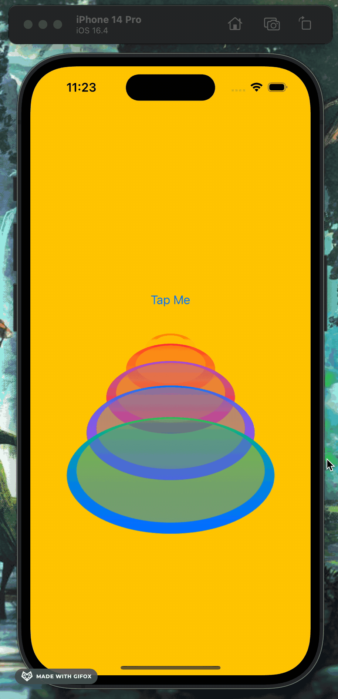

```swift
struct ContentView: View {
    @State private var gradients = [
        LinearGradient(colors: [.yellow, .green], startPoint: .top, endPoint: .bottom),
        LinearGradient(colors: [.orange, .yellow], startPoint: .top, endPoint: .bottom),
        LinearGradient(colors: [.red, .orange], startPoint: .top, endPoint: .bottom),
        LinearGradient(colors: [.purple, .red], startPoint: .top, endPoint: .bottom),
        LinearGradient(colors: [.blue, .purple], startPoint: .top, endPoint: .bottom),
        LinearGradient(colors: [.green, .blue], startPoint: .top, endPoint: .bottom)
    ]
    
    @State private var isEnabled = false
    var sizeFactors: [Int] {
        isEnabled ? [0,1,2,3,4,5] : [5,4,3,2,1,0]
    }
    
    var body: some View {
        ZStack {
            Color.yellow
                .ignoresSafeArea()
            VStack {
                Button("Tap Me\n") {
                    withAnimation(.easeOut) {
                        isEnabled.toggle()
                    }
                }
                ForEach(sizeFactors, id: \.self) { i in
                    Circle()
                        .opacity(0.5)
                        .overlay(
                            Circle()
                                .stroke(lineWidth: 10)
                        )
                        .frame(width: CGFloat(i * 50), height: CGFloat(i * 50)) Joe's 3D Circle Stack
                        
                        .rotation3DEffect(.degrees(60), axis: (x: 1, y: 0, z: 0))
                        .padding(CGFloat(i * -20))
                        .foregroundStyle(gradients[i])
                }
                
            }
        }
    }
}```


[](circleStack.gif)


![[2023-09-05 11.23.23 1.gif]]
